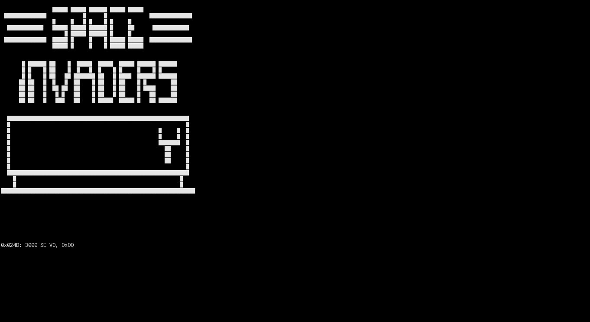

# About
Ghip8 is a golang learning project that implement a Chip8 interpreter/disassembler useful for developing a complete emulator.
Chip8 can be considered one of the first game engine 2D developed by Joseph Weisbecker for the COSMAC VIP.
More information on

https://en.wikipedia.org/wiki/CHIP-8  
http://devernay.free.fr/hacks/chip8/C8TECH10.HTM#1.0

# Example
This is a full working example of emulator that run on terminal thanks to the superb [termbox-go](https://github.com/nsf/termbox-go)
```
package main

import (
	"flag"
	"fmt"
	"io/ioutil"
	"time"

	"github.com/ilmich/ghip8"
	"github.com/nsf/termbox-go"
)

// Function tbprint draws a string.
func tbprint(x, y int, fg, bg termbox.Attribute, msg string) {
	for _, c := range msg {
		termbox.SetCell(x, y, c, fg, bg)
		x++
	}
}

var speedRender = map[uint8]string{
	0x00: "    ", 0x01: "   █", 0x02: "  █ ", 0x03: "  ██",
	0x04: " █  ", 0x05: " █ █", 0x06: " ██ ", 0x07: " ███",
	0x08: "█   ", 0x09: "█  █", 0x0A: "█ █ ", 0x0B: "█ ██",
	0x0C: "██  ", 0x0D: "██ █", 0x0E: "███ ", 0x0F: "████",
}

func main() {

	var filename = flag.String("f", "", "Chip8 source file")

	flag.Parse()

	chip8 := &ghip8.Chip8{}

	fmt.Printf("Loading file %s\n", filename)

	if buffer, err := ioutil.ReadFile(*filename); err == nil {
		chip8.Init()
		chip8.Load(buffer)

		err := termbox.Init()
		if err != nil {
			panic(err)
		}
		defer termbox.Close()

		ev := make(chan termbox.Event)

		go func() {
			for {
				ev <- termbox.PollEvent()
			}
		}()

	mainloop:
		for {
			select {
			case event := <-ev:
				if event.Type == termbox.EventKey {
					if event.Key == termbox.KeyEsc {
						break mainloop
					}
					chip8.KeyPressed(event.Ch)
				}
			default:
				_, cmd := chip8.Run()
				x, y := 0, 0
				for idx, cell := range chip8.VideoMemory {
					sprite := speedRender[cell>>4] + speedRender[cell&0x0F]
					tbprint(x, y, termbox.ColorDefault, termbox.ColorDefault, sprite)
					if (idx+1) %8 == 0 { // go next line
						y++
						x = 0
					} else {
						x += 8
					}
					tbprint(0, 40, termbox.ColorDefault, termbox.ColorDefault, cmd+"          ")
				}
				termbox.Flush()

				time.Sleep(1100 * time.Microsecond)
			}
		}
	} else {
		fmt.Printf("Error loading file %s", err)
	}

}
```

# Documentation
This library is very simple, and in my opinion the above example is self explanatory, but there is also a [godoc](https://godoc.org/github.com/ilmich/ghip8)